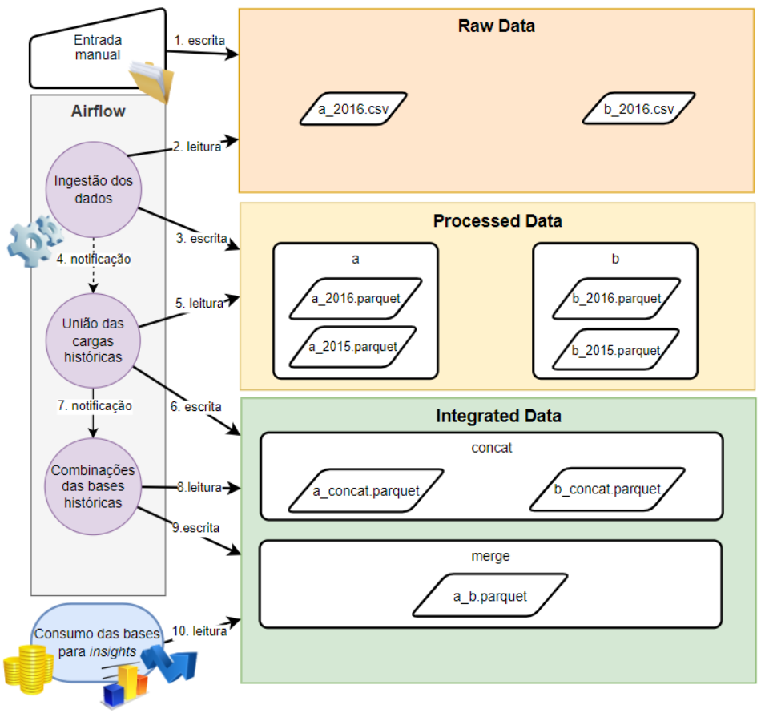

# Flexible Data Pipeline with Airflow

Este projeto representa uma pipeline de dados flexível desenvolvida com o uso do Apache Airflow. A principal finalidade dessa pipeline é oferecer a capacidade de adicionar ou remover novas fontes de dados de forma ágil, sem a necessidade de realizar mudanças significativas no código.

- Pipeline Diagrama:

::: mermaid
flowchart LR
    {init: {'theme': neutral' } }
    classDef blue fill:navy,stroke:#fff,stroke-width:2px,color:#fff

    START((START)):::blue
    IDAG((INGESTION \n DAG))
    UDAG((UPDATE \n DAG))
    MDAG((MERGE \n DAG))
    ODAF((REPORT \n DAG))
    %% RU((re))
    PURGE((PURGE))
    END((END)):::blue

    START --> IDAG
    IDAG --> UDAG
    IDAG -.->| NO NEW FILES | END
    UDAG-.->| FILES OUTDATED | END
    UDAG --> MDAG
    MDAG -.-> |FAIL MERGE CRITERIAS|END
    MDAG --> ODAF

    ODAF --> END
    START --> | EXECUTED EVERY MONTH| PURGE
    PURGE --> END
:::

- Imagem breve com exemplo de  fluxo:



## Pré-requisitos

### Docker
Antes de iniciar, certifique-se de ter o Docker e o Docker Compose instalados em sua máquina.

- [Docker](https://docs.docker.com/get-docker/)
- [Docker Compose](https://docs.docker.com/compose/install/)

### Python

Certifique-se de ter o Python instalado na sua máquina. Você pode verificar se o Python está instalado executando o seguinte comando no terminal:

```bash
python --version

```

O projeto pode ter dependências Python específicas que precisam ser instaladas. Normalmente, essas dependências são listadas em um arquivo chamado requirements.txt. Para instalá-las, siga estas etapas:

```bash
cd seu-diretorio-de-projeto
```

Use o comando pip para instalar as dependências listadas no requirements.txt:

```bash
pip install -r requirements.txt
```

### Azure

É necessário ter uma instância configurada do **Data Lake na Azure** para execução do projeto, abaixo temos algumas etapas gerais para essa configuração:

> 1. Crie uma Conta da Azure: Se você ainda não tem uma conta da Azure, crie uma em https://azure.com.
>
> 2. Crie um Data Lake Storage Gen2: Na Azure, crie um Data Lake Storage Gen2 para armazenar seus dados.
>
> 3. Obtenha as Credenciais: Você precisará obter as credenciais de acesso (chave de conta ou uma conta de serviço SAS) para o Data Lake Storage Gen2.
>
> 4. Configure o Acesso: Certifique-se de configurar as permissões e os níveis de acesso apropriados para os dados no Data Lake.
>
> 5. Integre com o Projeto: No seu projeto, você precisará configurar as variáveis de ambiente ou os arquivos de configuração para incluir as informações de conexão, como a chave de conta ou a conta de serviço SAS, o nome do contêiner do Data Lake, etc.

## Instruções de Uso

1. Clone este repositório para a sua máquina:

   ```bash
   git clone https://github.com/renanreyc/Airflow-Project-TCC.git
   ```
2. Navegue até o diretório clonado:

    ```bash
    cd seu-repositorio
    ```

3. Execute o Docker Compose para iniciar os serviços:

    ```bash
    docker-compose up -d
    ```

4. Após a inicialização, você pode acessar a interface da web do Apache Airflow em http://localhost:8080.

5. Você também pode acessar o Apache Drill em http://localhost:8047 para executar consultas SQL em seus dados.

Para parar os serviços, execute:

    ```bash
    docker-compose down
    ```

Lembre-se de que este ambiente é voltado principalmente para desenvolvimento e testes. Certifique-se de ajustar as configurações de acordo com as necessidades do seu projeto.

## Notas

> - Este ambiente usa as imagens Docker oficiais do Apache Airflow, PostgreSQL, Redis e Apache Drill. Certifique-se de verificar as versões e atualizações mais recentes dessas imagens, conforme necessário.
>
> - Certifique-se de revisar os recursos do seu sistema antes de iniciar o Docker Compose para garantir que você tenha memória, CPU e espaço em disco suficientes para executar os serviços.
>
> - Lembre-se de ajustar as variáveis de ambiente e outras configurações conforme necessário para seu ambiente específico.
>
> - Este README.md é apenas um guia básico. Consulte a documentação oficial dos serviços individuais para obter informações mais detalhadas.

## 📄 Licença

Esse projeto está sob a licença MIT. Veja o arquivo [LICENSE](LICENSE.md) para mais detalhes.